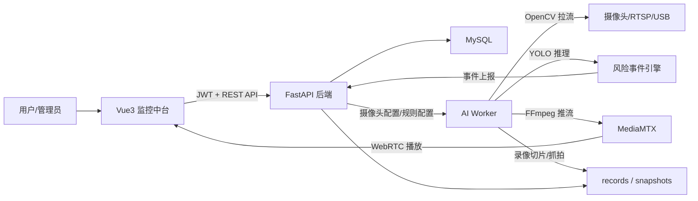
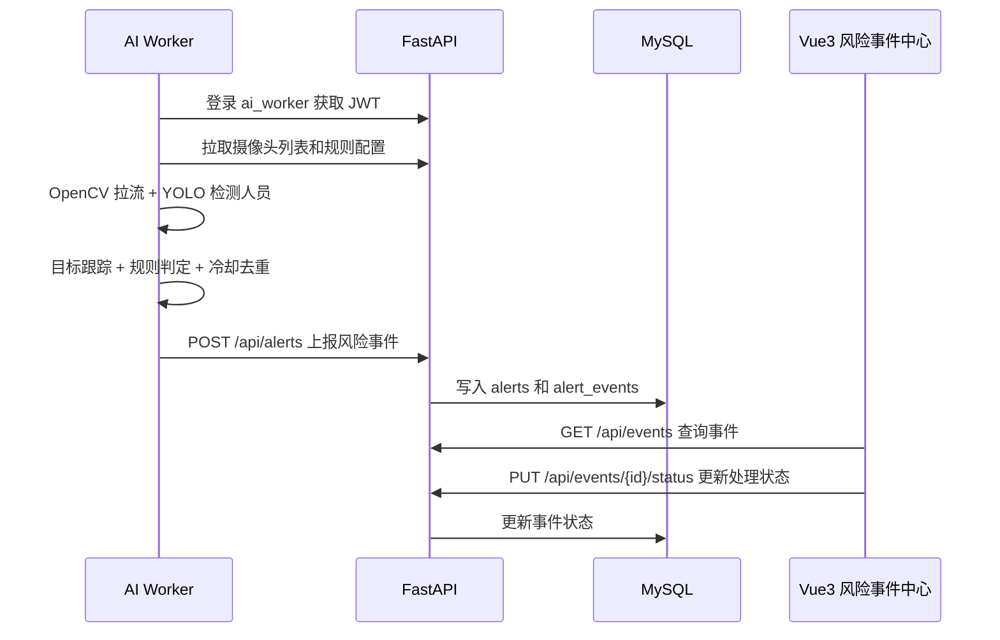

# 智能视频风险监控平台：简历写法与面试准备

## 1. 项目写进简历该怎么写

### 项目名称

智能视频风险监控平台

### 推荐简历版本一：后端开发重点版

智能视频风险监控平台  
技术栈：FastAPI、MySQL、PyMySQL、DBUtils、JWT、Vue3、Axios、YOLO、OpenCV、FFmpeg、MediaMTX

- 基于 FastAPI + MySQL 设计并实现智能视频监控系统后端，支持摄像头接入、实时状态同步、风险事件上报、告警抓拍、录像切片检索和用户认证等核心功能。
- 将原有“检测到人员即告警”的逻辑升级为基于 YOLO 检测结果的风险事件检测引擎，结合轻量级目标跟踪、禁区多边形、警戒线、人数阈值、停留时间和连续帧状态，实现禁区入侵、越线检测、人员聚集、长时间逗留、疑似倒地等事件识别。
- 设计 `camera_rules`、`alert_events` 等结构化数据模型，支持不同摄像头动态配置检测规则，并提供事件分页查询、类型筛选、风险等级筛选、状态流转和统计分析接口。
- 引入 JWT + RBAC 权限控制与 AI Worker 服务账号机制，区分管理员、运维、观察员和内部 AI 服务的访问边界，提升接口访问安全性。
- 通过 DBUtils 连接池优化 MySQL 连接管理，增加健康检查、服务指标汇总、日志记录和 `.env` 配置外置，提升系统可维护性和部署友好性。
- 使用 Vue3 构建监控中台页面，完成实时监控看板、风险事件中心、设备管理、风险规则管理等模块，并通过 Axios 拦截器统一处理 Token。

### 推荐简历版本二：项目亮点更强版

智能视频风险监控平台  
技术栈：FastAPI、MySQL、JWT、Vue3、YOLO、OpenCV、FFmpeg、MediaMTX

- 负责智能视频风险监控平台的后端设计与核心模块实现，系统支持多摄像头接入、AI 风险检测、告警抓拍、录像回放、风险规则配置和事件处理闭环。
- 基于 YOLO 目标检测结果构建风险事件检测引擎，结合中心点跟踪、多边形区域判断、越线方向判断、人数阈值和持续时间窗口，实现禁区入侵、越线、聚集、逗留和疑似倒地检测。
- 设计结构化风险事件模型，记录事件类型、风险等级、置信度、人数、区域名称、持续时间、处理状态和抓拍图，支撑事件检索、统计分析和状态流转。
- 为摄像头设计 JSON 化规则配置能力，使不同监控点可独立配置禁区区域、警戒线、聚集人数阈值、逗留时长和告警冷却时间。
- 完成 JWT 登录认证、RBAC 角色权限、AI Worker 内部账号鉴权、MySQL 连接池、健康检查、环境变量配置和日志记录等工程化能力建设。

### 推荐简历版本三：高级后端项目表达版

智能视频风险事件监控平台  
技术栈：FastAPI、MySQL、JWT、Vue3、YOLO、OpenCV、FFmpeg、MediaMTX、DBUtils

- 设计并实现面向多摄像头场景的智能风险事件监控平台，构建“视频接入 - AI 推理 - 规则判定 - 事件入库 - 告警处理 - 录像回溯”的完整业务闭环。
- 将 AI 检测服务从单一目标检测升级为事件驱动的风险识别流水线，基于 YOLO 检测框、轻量目标跟踪、区域/越线规则、时间窗口和冷却机制，将连续视频帧转化为结构化风险事件。
- 设计可配置规则引擎，使用 `camera_rules.config_json` 抽象不同规则参数，使禁区入侵、越线、聚集、逗留、疑似倒地等检测能力可以按摄像头独立配置和动态启停。
- 设计结构化事件模型 `alert_events`，沉淀事件类型、风险等级、置信度、人数、区域、持续时间、处理状态和抓拍文件，支持事件分页检索、统计分析、状态流转和前端处置工作台。
- 通过 JWT + RBAC + AI Worker 内部账号区分用户访问、运维操作、只读查看和 AI 服务上报，结合 MySQL 连接池、健康检查、配置外置、日志轮转等工程化能力，提升系统稳定性、可维护性和部署可迁移性。
- 使用 FFmpeg + MediaMTX 构建视频流转发与录像切片链路，实现处理后画面的实时播放、异常录像修复和历史片段回放。

这版适合简历主项目，表达会比“我做了一个监控系统”高级很多。注意面试时要能讲清楚规则引擎、事件模型和视频链路。

### 推荐简历版本四：压缩到 4 条的高级版

智能视频风险事件监控平台  
技术栈：FastAPI、MySQL、JWT、Vue3、YOLO、OpenCV、FFmpeg、MediaMTX

- 构建面向多摄像头场景的视频风险事件监控平台，实现摄像头管理、AI 风险检测、告警抓拍、录像回放、规则配置和事件处理闭环。
- 设计基于 YOLO 检测结果的事件识别流水线，结合轻量目标跟踪、区域规则、越线判断、时间窗口和冷却机制，实现禁区入侵、越线、聚集、逗留、疑似倒地等风险事件识别。
- 设计 `camera_rules` 与 `alert_events` 数据模型，将检测规则和风险事件结构化，支持按摄像头动态配置规则、事件分页检索、统计分析和状态流转。
- 完成 JWT 鉴权、RBAC 角色权限、AI Worker 内部服务账号、MySQL 连接池、环境变量配置、健康检查和日志治理等后端工程化能力，并使用 FFmpeg + MediaMTX 实现视频推流和录像切片。

### 如果你想写得更像“中高级后端”

可以把项目定位成：

> 一个以风险事件为核心的数据处理系统，而不是一个简单的 AI 摄像头 Demo。

更高级的关键词不是“微服务”“高并发”“高可用”，而是：

- 事件驱动
- 规则引擎
- 结构化事件建模
- 多阶段视频处理流水线
- 内部服务鉴权
- 告警去重与冷却
- 可观测性
- 可配置化
- 前后端闭环

### 简历一句话项目概括

基于 FastAPI + YOLO + FFmpeg 构建智能视频风险监控平台，实现多摄像头接入、实时风险事件检测、告警抓拍、录像回放、规则配置和事件处理闭环。

### 简历项目职责写法

如果简历里需要写“个人职责”，可以写：

- 负责后端 API 设计、数据库表结构设计、AI 检测服务接入和前后端联调。
- 负责将人员检测逻辑升级为风险事件检测逻辑，并实现规则配置、事件去重、抓拍上报和状态流转。
- 负责用户认证、AI 服务鉴权、连接池、健康检查、配置外置和日志治理等工程化改造。
- 负责前端监控中台页面开发，包括实时监控、告警中心、设备管理和风险规则管理。

### 简历项目亮点写法

可以重点突出这几个点：

- 从“人员检测”升级为“风险事件检测”，业务价值更完整。
- 支持不同摄像头独立配置检测规则，具备可扩展性。
- 风险事件结构化入库，支持筛选、统计和状态流转。
- AI 服务与后端通过 JWT 鉴权通信，避免裸接口上报。
- 使用 FFmpeg + MediaMTX 实现视频推流和录像切片。
- 增加 `.env`、健康检查、连接池、日志等后端工程化能力。

### 简历中不要夸大的地方

不要写：

- “高精度行为识别模型”
- “工业级算法”
- “摔倒检测准确率 99%”
- “支持海量并发”
- “微服务架构”

更稳妥的写法：

- “基于规则的风险事件检测”
- “疑似倒地检测”
- “轻量级目标跟踪”
- “支持多摄像头接入”
- “具备后续接入 DeepSORT、ByteTrack、姿态估计模型的扩展能力”

## 2. 项目详细开发流程

### 阶段一：需求分析

项目最初目标是做一个智能监控系统，能够接入摄像头画面，在检测到人员时进行告警抓拍，并支持前端查看实时画面和历史录像。

后续为了让项目更适合后端开发简历，需求从“人员检测告警”升级为“风险事件监控平台”：

- 摄像头接入和管理
- 实时视频流展示
- AI 检测服务
- 风险事件识别
- 告警抓拍
- 录像切片和历史回放
- 风险规则配置
- 用户登录和接口鉴权
- 健康检查和配置外置

### 阶段二：系统架构设计

系统采用前后端分离结构：

```text
Vue3 前端中台
    |
    | Axios + JWT
    v
FastAPI 后端服务
    |
    | PyMySQL + DBUtils
    v
MySQL 数据库

AI 检测服务
    |
    | OpenCV 拉流 + YOLO 推理 + 事件规则判断
    v
FFmpeg 推流 / 抓拍 / 录像
    |
    v
MediaMTX 提供 RTSP/WebRTC 视频服务
```

核心服务分工：

- 前端：展示实时监控、设备管理、风险规则管理、风险事件中心。
- FastAPI 后端：提供用户认证、摄像头管理、规则管理、告警事件、录像查询、健康检查等接口。
- AI 服务：拉取摄像头配置，读取视频流，执行 YOLO 检测和风险事件判断，上报告警。
- MediaMTX：负责 RTSP/WebRTC 视频流转发。
- FFmpeg：负责推流、转码、录像切片和录像修复。
- MySQL：存储用户、摄像头、规则、告警、事件等结构化数据。

### 更高级的架构表达

面试时不要只说“前后端分离 + YOLO”。可以把架构讲成三条链路：

1. 管理链路：用户在前端管理摄像头、规则和事件，后端负责鉴权、参数校验、数据库读写和统计查询。
2. 视频链路：AI 服务从摄像头拉流，处理后通过 FFmpeg 推送到 MediaMTX，前端通过 WebRTC/RTSP 播放实时画面。
3. 事件链路：AI 服务将连续帧检测结果转化为风险事件，经过去重和冷却后上报后端，后端结构化入库并进入事件处置流程。



### 风险事件处理链路

这是项目里最值得讲的链路：



### 面试中更高级的项目定义

可以这样说：

> 这个项目不是单纯做目标检测，而是围绕“风险事件”做了一套视频事件处理系统。YOLO 只解决“画面中有什么”，我在后端和 AI Worker 中补了“这些检测结果是否构成业务事件”的判断，包括规则配置、目标跟踪、持续时间、告警冷却、事件入库、统计检索和状态流转。

### 阶段三：数据库设计

核心表：

#### users

用于用户登录和角色区分。

主要字段：

- `id`
- `username`
- `password_hash`
- `role`

角色包括：

- `admin`
- `operator`
- `viewer`
- `ai_worker`

角色边界：

| 角色 | 权限说明 |
| --- | --- |
| `admin` | 系统管理员，默认拥有所有接口权限。 |
| `operator` | 运维角色，可管理摄像头、规则、告警和事件状态。 |
| `viewer` | 只读角色，可查看摄像头、规则、事件和录像，不允许修改。 |
| `ai_worker` | 内部服务角色，仅允许拉取摄像头/规则配置、更新摄像头状态和上报告警事件。 |

#### cameras

用于摄像头配置管理。

主要字段：

- `id`
- `name`
- `model`
- `input_source`
- `stream_path`
- `status`

#### alerts

兼容原有告警抓拍表。

主要字段：

- `id`
- `cam_name`
- `alert_type`
- `image_filename`
- `timestamp`

#### camera_rules

用于配置每个摄像头的风险检测规则。

主要字段：

- `id`
- `camera_id`
- `rule_type`
- `enabled`
- `rule_name`
- `risk_level`
- `config_json`
- `created_at`
- `updated_at`

`config_json` 示例：

```json
{
  "region_name": "仓库禁区",
  "region": [[120, 80], [600, 80], [600, 420], [120, 420]],
  "min_duration": 2,
  "cooldown_seconds": 30
}
```

#### alert_events

用于存储结构化风险事件。

主要字段：

- `id`
- `camera_id`
- `cam_name`
- `event_type`
- `event_name`
- `risk_level`
- `confidence`
- `person_count`
- `image_filename`
- `region_name`
- `event_start_time`
- `event_end_time`
- `duration_seconds`
- `status`
- `created_at`

### 阶段四：后端 API 开发

#### 认证接口

```text
POST /api/login
GET  /api/users/me
PUT  /api/users/me/password
```

实现点：

- 使用 `OAuth2PasswordBearer`
- 使用 `passlib` 的 bcrypt 进行密码哈希
- 使用 `python-jose` 生成和校验 JWT
- 前端登录后保存 Token
- Axios 拦截器统一携带 `Authorization: Bearer <token>`
- 使用 `require_roles(...)` 为不同接口声明角色权限，例如 `admin` 全权限、`operator` 可运维、`viewer` 只读、`ai_worker` 仅用于内部上报

#### 摄像头接口

```text
GET    /api/cameras
POST   /api/cameras
PUT    /api/cameras/{cam_id}
DELETE /api/cameras/{cam_id}
PUT    /api/cameras/{cam_id}/status
GET    /api/cameras/{cam_id}/records
```

实现点：

- 摄像头 CRUD
- 摄像头在线/离线状态同步
- 根据摄像头 ID 查询录像目录
- 动态生成录像访问 URL

#### 风险规则接口

```text
GET    /api/cameras/{cam_id}/rules
POST   /api/cameras/{cam_id}/rules
PUT    /api/rules/{rule_id}
DELETE /api/rules/{rule_id}
```

实现点：

- 每个摄像头可独立配置规则
- 规则配置以 JSON 形式存储
- AI 服务定期拉取规则并执行
- 支持启用、停用、删除规则

#### 告警和事件接口

```text
POST /api/alerts
GET  /api/alerts
GET  /api/events
GET  /api/events/stats
PUT  /api/events/{event_id}/status
```

实现点：

- `POST /api/alerts` 兼容旧抓拍告警，同时写入结构化事件表
- `GET /api/events` 支持分页、设备筛选、事件类型筛选、风险等级筛选、状态筛选
- `PUT /api/events/{event_id}/status` 支持事件状态流转
- `GET /api/events/stats` 返回事件统计数据

#### 健康检查接口

```text
GET /api/health
GET /api/metrics/summary
```

实现点：

- 检查数据库连接
- 检查存储目录可写性
- 返回摄像头数量、在线摄像头数量
- 返回今日事件数和启用规则数

### 阶段五：AI 检测服务开发

AI 服务主要流程：

```text
登录后端获取 Token
轮询摄像头配置
为每个摄像头启动处理线程
OpenCV 拉取视频流
YOLO 执行人员检测
轻量目标跟踪
读取摄像头风险规则
执行风险事件判断
生成抓拍图片
上报后端
FFmpeg 推流到 MediaMTX
旁路线程录制视频
```

### 阶段六：风险事件检测引擎

#### 目标检测

使用 YOLO 检测人员，主要关注 `person` 类别。

```python
if int(box.cls[0]) == 0:
    # person
```

#### 轻量目标跟踪

使用中心点距离进行简单跟踪：

- 为每个检测框计算中心点
- 与上一帧轨迹做距离匹配
- 维护 `track_id`
- 记录历史中心点、首次出现时间、最后出现时间和框宽高比

这样可以支持：

- 越线判断
- 逗留判断
- 持续入侵判断
- 疑似倒地持续判断
- 告警去重

#### 禁区入侵

规则：

```text
人员中心点进入配置的多边形区域
并持续超过 min_duration 秒
触发告警
```

关键算法：

- 点在多边形内判断
- 持续时间判断
- 冷却时间判断

#### 越线检测

规则：

```text
同一 track_id 的中心点从警戒线一侧移动到另一侧
并满足方向要求
触发告警
```

关键算法：

- 通过叉积判断点在线段哪一侧
- 比较上一帧和当前帧所在侧

#### 人员聚集

规则：

```text
指定区域内人数 >= person_threshold
并持续超过 duration_threshold 秒
触发告警
```

#### 长时间逗留

规则：

```text
同一 track_id 在指定区域内停留超过 duration_threshold 秒
触发告警
```

#### 疑似倒地

规则：

```text
人体检测框宽高比 >= aspect_ratio_threshold
并持续超过 duration_threshold 秒
触发疑似倒地告警
```

说明：

这是基于检测框形态的规则判断，只能称为“疑似倒地”，不能说成高精度摔倒识别。

### 阶段七：视频推流和录像

#### 实时推流

流程：

```text
OpenCV 读取帧
YOLO 标注检测框
绘制规则区域和事件文字
FFmpeg 接收 raw frame
FFmpeg 推 RTSP 到 MediaMTX
前端通过 WebRTC 地址播放
```

#### 录像切片

流程：

```text
AI 服务启动旁路录像线程
FFmpeg 从 RTSP 拉流
每 10 分钟切成一个 MP4
文件名记录开始时间和结束时间
前端按日期和时间筛选播放
```

#### 录像修复

服务启动时扫描 `_recording.mp4` 残留文件，使用 FFmpeg 重新封装，避免异常中断导致视频不可播放。

### 阶段八：前端开发

前端技术栈：

- Vue3
- Vue Router
- Axios
- Vite

主要页面：

#### 登录页

- 用户名密码登录
- 获取 JWT
- 保存 Token 到 `sessionStorage`
- 登录后跳转监控看板

#### 实时监控看板

- 展示摄像头实时画面
- 展示在线/离线状态
- 支持打开历史录像
- 支持按日期和时间筛选录像片段

#### 设备管理

- 摄像头列表
- 新增摄像头
- 编辑摄像头
- 删除摄像头
- 展示流地址、通道路径和状态

#### 风险规则管理

- 选择摄像头
- 新增规则
- 配置规则类型
- 配置区域坐标、警戒线、人数阈值、持续时间、冷却时间
- 启用/停用规则
- 删除规则

#### 风险事件中心

- 展示事件统计
- 按设备、事件类型、风险等级、状态筛选
- 表格展示结构化事件
- 查看抓拍图
- 修改处理状态
- 根据当前用户角色控制操作能力，`viewer` 只能查看事件，`admin/operator` 才能流转事件状态

### 阶段九：工程化改造

#### 配置外置

新增 `.env.example`，支持配置：

- MySQL 地址
- 数据库账号密码
- JWT Secret
- Token 过期时间
- CORS 白名单
- 默认管理员账号
- AI Worker 账号
- 后端 API 地址

配置加载逻辑已抽取到 `yolov26/settings.py`，API 服务和 AI Worker 共用同一套配置来源：

```text
yolov26/settings.py
  - 加载项目根目录 .env
  - 加载 yolov26/.env
  - 提供 Settings 配置对象
  - 统一管理 MySQL、JWT、CORS、默认账号、AI Worker、API 地址和角色常量
```

这样避免了 `api_server.py` 和 `ai_server.py` 各自重复读取环境变量，也为安全认证、数据库访问和业务接口继续拆分做铺垫。

#### 后端分层重构进展

当前已经完成三步核心重构：共享配置层抽取、安全认证层抽取，以及用户/摄像头/风险规则/事件/告警 Repository 数据访问层抽取。

```text
yolov26/
  settings.py       统一配置加载和 Settings 对象
  security.py       密码哈希、JWT 签发校验、当前用户依赖、RBAC 角色校验
  repositories/
    user_repository.py    用户查询、密码哈希读取和密码更新
    camera_repository.py  摄像头查询、新增、更新、删除、状态更新和统计
    rule_repository.py    风险规则查询、新增、更新、删除、JSON 配置解析和启用统计
    event_repository.py   风险事件统计、分页筛选、时间格式化和状态流转
    alert_repository.py   告警上报、抓拍告警查询、告警删除和事件联动写入
  services/
    alert_service.py          告警业务编排、抓拍文件清理
    notification_service.py   WebSocket 风险事件推送
  api_server.py     FastAPI API 服务
  ai_server.py      AI Worker 服务
tests/
  test_security.py       JWT 签发和解析测试
  test_repositories.py   Repository 数据访问逻辑测试
  test_services.py       告警 Service 文件清理测试
docker-compose.yml       MySQL、MediaMTX、后端、前端、AI Worker 编排
```

现在 `api_server.py` 不再直接维护 JWT Secret、bcrypt 上下文和角色校验细节，而是通过 `security.py` 暴露的依赖工厂完成装配：

- `create_access_token(...)`：统一签发 JWT
- `verify_password(...)` / `get_password_hash(...)`：统一处理密码校验和哈希
- `make_current_user_dependency(...)`：根据 Token 解析用户身份，并把数据库用户查询逻辑以回调方式注入
- `make_role_dependency(...)`：统一实现 `admin / operator / viewer / ai_worker` 的接口级访问控制

这种处理方式的好处是：安全逻辑可复用、鉴权边界更清晰，后续拆分路由时不需要在每个路由文件里复制 Token 解析逻辑。

同时，用户、摄像头、风险规则、事件查询和告警上报相关 SQL 已经从 `api_server.py` 抽到 `repositories` 目录：

- `UserRepository.find_by_username(...)`：用于登录和 Token 解析后的用户加载
- `UserRepository.get_password_hash(...)` / `update_password_hash(...)`：用于个人密码修改
- `CameraRepository.list_all(...)`：用于摄像头列表
- `CameraRepository.input_source_exists(...)`：用于新增和编辑时的视频源冲突校验
- `CameraRepository.create(...)` / `update(...)` / `delete(...)` / `update_status(...)`：用于摄像头生命周期管理
- `CameraRepository.count_summary(...)`：用于健康检查和首页指标统计
- `RuleRepository.list_by_camera(...)`：用于按摄像头加载规则列表
- `RuleRepository.create(...)` / `update(...)` / `delete(...)`：用于风险规则生命周期管理
- `RuleRepository.active_count(...)`：用于首页启用规则数量统计
- `RuleRepository._normalize_rule(...)`：把数据库中的 `config_json` 转成接口返回的结构化 `config`
- `EventRepository.stats(...)`：用于事件总数、今日事件、风险等级分布和事件类型 TopN 统计
- `EventRepository.list_events(...)`：用于事件分页查询，以及按摄像头、事件类型、风险等级、处理状态筛选
- `EventRepository.update_status(...)`：用于事件状态流转，例如 `new / confirmed / ignored / resolved`
- `EventRepository.today_count(...)`：用于首页今日事件数量统计
- `AlertRepository.create_with_event(...)`：用于 AI Worker 上报告警时同时写入 `alerts` 和 `alert_events`
- `AlertRepository.list_alerts(...)`：用于抓拍告警列表查询
- `AlertRepository.get_image_filenames(...)` / `delete_by_ids(...)`：用于批量删除告警前查询抓拍文件名，并删除数据库记录

这样 API 层只负责 HTTP 入参、权限声明和响应组织，Repository 层负责 MySQL 访问和连接关闭，职责边界更清晰。

Service 层当前承担跨资源业务编排：

- `AlertService.create_alert(...)`：封装告警创建入口，内部调用 Repository 同步写入抓拍告警和结构化事件。
- `AlertService.delete_alerts(...)`：先查询抓拍文件名，再删除本地抓拍文件，最后删除数据库告警记录。
- `EventNotificationService.broadcast(...)`：维护 WebSocket 连接，在 AI Worker 上报告警成功后向前端推送 `risk_event_created` 消息。

前端风险事件中心已接入 `/ws/events`，收到新事件后自动刷新统计和第一页事件列表，避免只能靠人工点击刷新。

当前完成度：

- 后端核心业务 SQL 已从 API 路由中抽离，路由层不再直接处理用户、摄像头、规则、事件和告警的业务查询。
- `api_server.py` 保留数据库初始化 SQL，这是启动建表和默认账号初始化逻辑，不属于业务路由 SQL。
- AI Worker 已支持风险事件检测、规则拉取、事件冷却和鉴权上报。
- 前端已具备监控中台风格、角色感知、风险事件中心、规则配置入口和 WebSocket 实时事件刷新。
- 已新增 `pytest` 测试，覆盖 JWT、Repository 归一化/更新逻辑和告警 Service 文件清理逻辑；开发依赖可通过 `pip install -r yolov26/requirements-dev.txt` 安装。
- 已新增 Docker Compose，支持 MySQL、MediaMTX、后端 API、前端静态服务和可选 AI Worker 编排。
- 项目已经可以作为后端开发简历项目使用，重点讲“规则配置 - AI 检测 - 事件入库 - 告警处理 - 录像回放”的闭环。

后续如继续做生产级增强，可以考虑：

```text
yolov26/backend/
  core/
    config.py
    security.py
    rbac.py
  db/
    session.py
    init_db.py
  routers/
    auth.py
    cameras.py
    rules.py
    events.py
  services/
    camera_service.py
    rule_service.py
    event_service.py
  repositories/
    camera_repo.py
    rule_repo.py
    event_repo.py
```

面试时可以这样说：

> 当前项目已经把配置层、安全认证层、数据访问层和部分 Service 层抽出来。配置层统一管理 MySQL、JWT、CORS、默认账号和服务地址；安全层统一处理 bcrypt 密码哈希、JWT 签发校验和 RBAC 权限控制；Repository 层负责用户、摄像头、风险规则、事件查询和告警上报相关 SQL；Service 层负责告警创建、抓拍文件清理和 WebSocket 实时推送。API 服务只负责路由、权限声明、参数校验和响应组织。项目还补了 pytest 测试和 Docker Compose 编排，整体更接近真实后端工程。

#### 日志

使用 `loguru`：

- 按日期记录 API 服务日志
- 按日期记录 AI 服务日志
- 设置日志轮转和保留时间

#### 数据库连接池

使用 `DBUtils.PooledDB` 管理 MySQL 连接：

- 避免频繁创建连接
- 支持并发请求下的连接复用
- 降低数据库连接开销

#### 健康检查

`GET /api/health` 返回：

- 服务状态
- 数据库状态
- 存储状态
- 摄像头数量
- 在线摄像头数量
- 当前时间

## 3. 项目技术栈

### 后端

- FastAPI：构建 RESTful API
- Uvicorn：ASGI 服务运行
- PyMySQL：连接 MySQL
- DBUtils：数据库连接池
- Pydantic：请求参数校验
- Passlib：密码哈希
- python-jose：JWT 生成和校验
- Loguru：日志管理

### 数据库

- MySQL
- 表结构包括 users、cameras、alerts、camera_rules、alert_events

### AI 和视频处理

- YOLO：人员目标检测
- OpenCV：视频读取、帧处理、绘制检测框
- FFmpeg：推流、录像切片、视频修复
- MediaMTX：RTSP/WebRTC 媒体服务

### 前端

- Vue3：前端框架
- Vue Router：路由管理
- Axios：接口请求
- Vite：构建工具

## 4. 面试官可能提问的问题与回答

### 4.1 项目整体类问题

#### Q1：这个项目是做什么的？

答：

这是一个智能视频风险监控平台，支持摄像头接入、实时画面查看、AI 风险事件检测、告警抓拍、录像切片回放、规则配置和事件处理。后端使用 FastAPI 和 MySQL，AI 服务使用 YOLO、OpenCV 和 FFmpeg，前端使用 Vue3。

#### Q2：你在项目中负责什么？

答：

我主要负责后端 API、数据库设计、AI 检测服务接入和前端中台页面开发。重点做了摄像头管理、风险规则配置、结构化事件模型、风险事件检测引擎、JWT 鉴权、AI 服务上报、健康检查和配置外置。

#### Q3：项目最大亮点是什么？

答：

最大亮点是把原本简单的“检测到人就告警”升级为“基于规则的风险事件检测”。系统可以针对不同摄像头配置禁区、警戒线、人数阈值和停留时间，并将 AI 检测结果转换成结构化风险事件，支持后续查询、统计和处理状态流转。

#### Q4：这个项目为什么适合写后端简历？

答：

它不只是调用 AI 模型，还包含后端工程中的很多关键能力，比如 RESTful API 设计、数据库建模、连接池、JWT 鉴权、配置外置、服务健康检查、事件状态流转、前后端联调和日志治理。

### 4.2 FastAPI 相关问题

#### Q5：为什么选择 FastAPI？

答：

FastAPI 性能较好，开发效率高，天然支持 Pydantic 参数校验和 OpenAPI 文档，适合快速构建前后端分离项目。这个项目接口较多，包括登录、摄像头、告警、规则和健康检查，用 FastAPI 可以比较清晰地组织这些 API。

#### Q6：FastAPI 中 Depends 是做什么的？

答：

`Depends` 是依赖注入机制。项目中用它注入当前登录用户，例如业务接口都依赖 `get_current_user`，这个函数会解析 JWT，校验 Token，并从数据库查询用户。如果校验失败就返回 401。

#### Q7：FastAPI 如何处理跨域？

答：

项目使用 `CORSMiddleware`。开发环境默认允许所有来源，也支持通过 `CORS_ORIGINS` 环境变量配置白名单。生产环境应该配置具体前端域名，而不是使用 `*`。

#### Q8：为什么要加健康检查接口？

答：

健康检查接口可以让开发者或部署平台快速判断服务是否正常，例如数据库是否可连、存储目录是否可写、当前摄像头数量和在线数量。这样排查问题比只看服务进程是否存在更可靠。

### 4.3 JWT 和认证相关问题

#### Q9：JWT 登录流程是什么？

答：

用户提交用户名和密码，后端从数据库查用户并用 bcrypt 校验密码。如果通过，后端生成 JWT，里面包含用户名和角色，并设置过期时间。前端保存 Token，后续请求通过 `Authorization: Bearer <token>` 传给后端，后端解析并校验。

#### Q10：为什么密码不能明文存储？

答：

如果数据库泄露，明文密码会直接暴露用户账号。项目使用 bcrypt 哈希密码，即使数据库泄露，攻击者也不能直接拿到原始密码。

#### Q11：为什么之前随机 JWT Secret 不好？

答：

如果每次服务重启都随机生成 JWT Secret，那么之前签发的 Token 会全部失效，用户会被迫重新登录。现在改成从环境变量读取，保证服务重启后 Token 仍可验证。

#### Q12：AI Worker 账号有什么作用？

答：

AI 服务需要调用后端接口上报摄像头状态和风险事件。如果这些接口完全裸露会有安全风险，所以给 AI 服务分配一个内部账号 `ai_worker`，AI 服务登录后拿 Token，再调用后端接口。

#### Q13：RBAC 是怎么实现的？

答：

项目中基于 JWT 解析出当前用户，再从数据库读取用户角色。后端定义了 `require_roles(...)` 依赖函数，不同接口声明自己允许的角色。比如摄像头新增和规则修改允许 `operator` 和 `admin`，事件查询允许 `viewer`，AI 上报接口允许 `ai_worker`。`admin` 作为管理员拥有所有权限。

#### Q14：为什么 AI Worker 不能直接用管理员账号？

答：

如果 AI Worker 使用管理员账号，一旦 Token 泄露，攻击者就可以删除摄像头、修改规则或删除告警。单独设置 `ai_worker` 角色可以把权限限制在拉取配置、更新状态和上报告警这几个内部操作上，符合最小权限原则。

### 4.4 数据库相关问题

#### Q15：为什么要设计 camera_rules 表？

答：

因为不同摄像头的检测需求不同。例如仓库摄像头需要禁区入侵，门口摄像头需要越线检测，大厅摄像头需要聚集检测。把规则存入 `camera_rules`，可以做到每个摄像头独立配置，不需要改 AI 服务代码。

#### Q16：为什么规则配置用 JSON？

答：

不同规则需要的配置字段不一样。禁区入侵需要多边形区域，越线检测需要线段和方向，聚集检测需要人数阈值和持续时间。用 JSON 存储灵活性更高，方便扩展新规则。

#### Q17：alert_events 和 alerts 有什么区别？

答：

`alerts` 是原始告警抓拍表，主要兼容旧页面。`alert_events` 是结构化风险事件表，字段更完整，包括事件类型、风险等级、人数、置信度、区域、持续时间和处理状态，更适合查询、统计和业务闭环。

#### Q18：为什么要用连接池？

答：

Web 服务会频繁访问数据库，如果每次请求都新建连接，会增加开销，也容易造成连接数过多。使用连接池可以复用连接，提高性能和稳定性。

#### Q19：这个项目数据库还有什么可以优化？

答：

可以引入 SQLAlchemy 和 Alembic，替代手写建表 SQL；可以给高频查询字段增加索引；可以把录像元数据单独建表；可以增加独立的角色表、权限表和用户角色关联表，让 RBAC 从代码常量升级为数据库可配置。

### 4.5 AI 检测相关问题

#### Q20：YOLO 在项目中负责什么？

答：

YOLO 负责目标检测，当前主要检测人员类别。它输出人员检测框，后续事件引擎根据检测框、中心点、轨迹、区域和规则判断是否构成风险事件。

#### Q21：YOLO 能直接识别危险行为吗？

答：

YOLO 原生更擅长目标检测，不擅长直接理解复杂行为。项目中的危险事件是基于 YOLO 检测结果加规则引擎实现的。例如禁区入侵、越线、聚集和逗留可以通过检测框和轨迹判断；疑似倒地是基于人体框宽高比和持续时间做初步判断。

#### Q22：疑似倒地为什么叫“疑似”？

答：

因为当前是通过人体检测框宽高比判断，不是专业的姿态估计或视频动作识别模型。人体横向躺倒时框可能变宽，但也可能因为遮挡、角度或多人重叠产生误判，所以称为“疑似倒地”更准确。

#### Q23：如果要提高摔倒检测准确率，你会怎么做？

答：

可以引入姿态估计模型，例如 YOLO Pose、OpenPose 或 MediaPipe，分析人体关键点；也可以使用视频动作识别模型，例如 SlowFast、VideoMAE 或 MMAction2；还可以结合连续帧时序模型，降低单帧误判。

#### Q24：目标跟踪是怎么实现的？

答：

当前使用轻量级中心点跟踪。每一帧拿到检测框后计算中心点，与已有轨迹的中心点计算距离，距离小于阈值就认为是同一个目标，否则创建新 track。每个 track 维护 ID、历史点、首次出现时间和最后出现时间。

#### Q25：为什么不直接用 DeepSORT 或 ByteTrack？

答：

项目当前目标是先实现完整业务闭环，所以采用轻量级中心点跟踪，依赖少、实现简单、足够支撑越线、逗留和持续入侵判断。后续如果要提升多目标遮挡情况下的稳定性，可以替换为 DeepSORT 或 ByteTrack。

#### Q26：禁区入侵怎么判断？

答：

先配置一个多边形区域，AI 服务检测到人后取检测框中心点，判断中心点是否在多边形内。如果持续超过配置的最短时间，并且不在冷却期内，就生成禁区入侵事件。

#### Q27：越线检测怎么判断？

答：

通过叉积判断目标中心点在警戒线的哪一侧。如果同一个 track ID 的中心点从一侧移动到另一侧，就认为发生越线。规则里还可以配置方向，例如任意方向、正侧到负侧、负侧到正侧。

#### Q28：人员聚集怎么判断？

答：

统计指定区域内的人员数量，如果数量大于等于配置阈值，并持续超过配置时间，就触发人员聚集事件。

#### Q29：长时间逗留怎么判断？

答：

同一个 track ID 如果持续停留在指定区域内，并超过配置的时长阈值，就触发长时间逗留事件。

#### Q30：如何避免连续帧重复告警？

答：

项目中使用事件冷却机制。每个事件会生成一个 key，例如摄像头、规则、事件类型和 track ID 组合。同一个 key 在冷却时间内只允许上报一次，避免每帧都写入告警。

### 4.6 视频处理相关问题

#### Q31：OpenCV、FFmpeg、MediaMTX 分别做什么？

答：

OpenCV 用于读取视频帧、处理图像和绘制检测结果。FFmpeg 用于将处理后的帧推成 RTSP 流，同时负责录像切片和视频修复。MediaMTX 作为流媒体服务器，负责接收 RTSP 流并提供 WebRTC/RTSP 播放能力。

#### Q32：为什么要用 FFmpeg 推流？

答：

AI 服务处理完每帧后，需要把带检测框和规则标注的视频重新输出给前端。FFmpeg 对视频编码和推流支持成熟，可以把 raw frame 编码成 H.264 并推送到 RTSP 服务。

#### Q33：录像切片为什么按时间分段？

答：

长时间录像文件过大，不利于存储和播放。按固定时间切片可以方便前端按时间检索，也方便定期清理和异常恢复。

#### Q34：异常中断录像为什么需要修复？

答：

如果服务被强制关闭，正在写入的 MP4 可能缺少完整元数据，导致浏览器无法播放。项目启动时扫描 `_recording.mp4` 文件，并用 FFmpeg 重新封装，尽量恢复可播放状态。

### 4.7 前端相关问题

#### Q35：前端有哪些页面？

答：

包括登录页、实时监控看板、风险事件中心、风险规则管理、设备管理和用户中心。

#### Q36：前端如何统一携带 Token？

答：

在 `main.js` 中配置 Axios 请求拦截器，从 `sessionStorage` 读取 `access_token`，并添加到 `Authorization` 请求头中。

#### Q37：前端如何处理 Token 过期？

答：

Axios 响应拦截器会判断后端返回的 401 状态码，如果 Token 无效或过期，就清除本地 Token 并跳转到登录页。

#### Q38：风险规则管理页面如何工作？

答：

用户选择摄像头和规则类型，填写区域坐标、警戒线、人数阈值、持续时间和冷却时间，前端将这些配置提交到后端 `camera_rules` 表。AI 服务会定期拉取这些规则并应用到对应摄像头。

#### Q39：风险事件中心相比原告警中心有什么提升？

答：

原告警中心只是展示截图和文本。风险事件中心展示的是结构化事件，支持统计、筛选、查看抓拍、修改处理状态，更接近真实业务系统中的告警处理工作台。

### 4.8 工程化相关问题

#### Q40：为什么要做配置外置？

答：

数据库密码、JWT Secret、服务地址等不应该写死在代码里。使用 `.env` 可以区分开发、测试和生产环境，也避免敏感信息被提交到 Git。

#### Q41：`.env.example` 有什么作用？

答：

`.env.example` 是配置模板，告诉其他开发者需要哪些配置项，但不包含真实敏感信息。真实 `.env` 应该加入 `.gitignore`，不提交。

#### Q42：日志有什么用？

答：

日志用于排查问题，例如 AI 服务是否登录成功、摄像头是否连接失败、风险事件是否上报成功、录像修复是否成功。没有日志的话，线上问题很难定位。

#### Q43：项目目前有哪些不足？

答：

主要不足包括：

- Router 层还可以继续拆分，目前 API 路由仍集中在 `api_server.py`。
- 数据库还没有引入 SQLAlchemy 和 Alembic，建表和迁移仍然偏脚本化。
- 目标跟踪是轻量级方案，复杂遮挡场景下不够稳定。
- 疑似倒地只是规则判断，不是专业行为识别模型。
- 测试已经覆盖核心模块，但还可以继续补充端到端接口测试、压力测试和 CI。

#### Q44：如果继续优化，你会怎么做？

答：

我会从四个方向优化：

- 后端架构：继续拆分 Router 层，引入 SQLAlchemy 和 Alembic。
- AI 算法：引入 ByteTrack 或 DeepSORT，摔倒检测升级为姿态估计或动作识别模型。
- 实时通信：在现有 WebSocket 推送基础上增加弹窗通知、断线重连和消息确认。
- 部署测试：在现有 Docker Compose 和 pytest 基础上补充 CI 构建、端到端接口测试和压测。

### 4.9 性能和并发相关问题

#### Q45：多路摄像头怎么处理？

答：

AI 服务为每个摄像头启动独立线程，每个线程负责拉流、推理、事件判断、推流和录像。为了避免模型并发推理导致 GPU 上下文竞争，项目使用全局推理锁控制 YOLO 推理。

#### Q46：全局推理锁会不会影响性能？

答：

会限制多个摄像头同时推理的并行度，但可以避免显存竞争和 CUDA 上下文异常。对于个人项目和少量摄像头，这是稳定性优先的选择。后续可以通过模型多实例、推理队列或独立 AI Worker 进程优化。

#### Q47：为什么要抽帧推理？

答：

视频通常 25 或 30 FPS，如果每帧都推理，计算压力很大。项目每隔几帧做一次真实推理，中间复用检测框和轨迹，这样可以降低算力消耗，同时保持较好的实时性。

#### Q48：后端接口如何提升并发能力？

答：

当前使用连接池减少数据库连接开销。后续可以进一步优化 SQL、增加索引、使用异步数据库驱动、缓存统计数据、拆分 AI 上报和前端查询接口，必要时引入消息队列。

### 4.10 安全相关问题

#### Q49：项目有哪些安全措施？

答：

主要包括：

- 用户密码 bcrypt 哈希存储。
- 使用 JWT 做接口鉴权。
- AI 服务使用专属账号登录后上报。
- 敏感配置通过 `.env` 管理。
- CORS 支持配置白名单。

#### Q50：还有哪些安全风险？

答：

目前还可以继续加强：

- 将当前代码常量式 RBAC 升级为数据库可配置权限模型。
- 继续收紧 AI Worker 权限，例如只允许访问配置读取、状态更新和事件上报相关接口。
- 对上传/访问的文件路径做更严格校验。
- 生产环境关闭 CORS `*`。
- JWT Secret 使用高强度随机值。
- 增加登录失败次数限制。

### 4.11 扩展设计问题

#### Q51：如果要支持更多危险行为怎么扩展？

答：

可以在规则系统中新增 `rule_type`，然后在 AI 服务的事件引擎中增加对应检测器。例如安全帽检测可以训练自定义 YOLO 类别；打架检测可以接入动作识别模型；烟火检测可以训练火焰/烟雾检测模型。

#### Q52：如果要做 WebSocket 实时告警怎么设计？

答：

后端维护 WebSocket 连接，AI 服务上报告警后，后端写入数据库并向在线前端推送事件。前端收到事件后实时更新风险事件中心和弹出通知。这样可以减少轮询，提高实时性。

#### Q53：如果要做微服务拆分怎么拆？

答：

可以拆为：

- API 服务：用户、摄像头、规则、事件管理。
- AI Worker 服务：视频拉流和风险检测。
- Stream 服务：推流和录像管理。
- Storage 服务：图片和录像文件管理。

服务之间可以通过 HTTP、Redis Stream、RabbitMQ 或 Kafka 通信。

#### Q54：如果要关联告警和录像怎么做？

答：

可以新增 `recordings` 表，记录摄像头 ID、文件名、开始时间、结束时间、文件大小和状态。事件发生时，根据 `camera_id` 和 `event_start_time` 查询对应录像片段，并把 `recording_id` 写入事件表。

### 4.12 简历深挖问题

#### Q55：这个项目你遇到最大的难点是什么？

答：

难点主要有两个。第一是 AI 检测结果如何转成业务上的风险事件，所以我设计了规则引擎和事件去重机制。第二是视频处理链路比较长，涉及 OpenCV 拉流、YOLO 推理、FFmpeg 推流、MediaMTX 播放和录像切片，需要保证每一环都能稳定工作。

#### Q56：你怎么证明项目不是简单调包？

答：

项目不只是调用 YOLO。YOLO 只负责输出检测框，我还做了目标跟踪、区域判断、越线判断、持续时间判断、告警冷却、结构化事件入库、规则配置、状态流转、健康检查和前端工作台。这些都是围绕业务场景做的系统设计。

#### Q57：如果面试官问你项目数据量不大，连接池有必要吗？

答：

即使当前数据量不大，连接池也是一种良好的工程实践。它可以避免每次请求都创建和销毁连接，降低数据库连接开销，也为后续多摄像头、多用户访问做准备。

#### Q58：你会如何把这个项目做成生产级？

答：

我会做以下改造：

- 继续拆 Router 层，并把复杂跨表逻辑进一步沉到 Service 层。
- 引入 ORM 和数据库迁移。
- 将当前 RBAC 从代码常量升级为角色表、权限表和用户角色关联表。
- 在现有 Docker Compose 基础上补充生产环境 Nginx、HTTPS 和日志挂载。
- 在现有 WebSocket 实时推送基础上补充断线重连、消息确认和前端通知。
- 引入消息队列处理 AI 事件上报。
- 在现有核心单元测试基础上增加接口测试和压力测试。
- 增加 Prometheus/Grafana 监控。

### 4.13 高级系统设计追问

#### Q59：你这个项目里的“规则引擎”怎么设计，为什么算规则引擎？

答：

这里的规则引擎不是复杂的商业规则引擎，而是一个面向视频风险检测场景的轻量规则执行器。它把不同检测逻辑抽象成统一结构：

```text
rule_type + enabled + risk_level + config_json
```

AI Worker 根据 `rule_type` 分发到不同检测逻辑，例如 `intrusion`、`line_crossing`、`crowding`。每类规则都从 `config_json` 读取自己的参数，比如区域坐标、警戒线、人数阈值、持续时间和冷却时间。这样新增规则时不用改数据库表结构，只需要扩展一种规则类型和对应检测器。

#### Q60：如果规则越来越多，你怎么避免 EventEngine 变成一堆 if else？

答：

可以把当前逻辑进一步重构成策略模式：

```text
BaseDetector
  - IntrusionDetector
  - LineCrossingDetector
  - CrowdingDetector
  - LoiteringDetector
  - FallSuspectedDetector
```

每个 Detector 实现统一接口：

```python
detect(tracks, frame_shape, rule, context) -> list[Event]
```

EventEngine 只负责加载规则、分发 Detector、维护上下文和处理冷却。这样后续新增安全帽、烟火、攀爬等检测能力时，只需要新增 Detector，不会污染主流程。

#### Q61：事件去重为什么不能只靠数据库唯一索引？

答：

因为风险事件是连续帧产生的。如果只靠数据库唯一索引，AI 服务仍然会每帧发请求，后端会承受大量无效写入和冲突处理。更合理的是在 AI Worker 内部先做冷却和活动事件缓存，从源头减少重复上报。数据库唯一约束可以作为兜底，但不应该承担主要去重逻辑。

#### Q62：为什么事件状态流转很重要？

答：

真实业务里告警不是展示出来就结束了，而是需要处理闭环。事件状态可以区分：

- `new`：待处理
- `confirmed`：人工确认是真实风险
- `ignored`：误报或无需处理
- `resolved`：已处置

这让系统从“告警展示页面”升级为“事件处置系统”，也方便后续统计误报率、处理效率和风险趋势。

#### Q63：如果前端要实时收到告警，你会怎么改？

答：

目前前端通过接口查询事件。要做实时告警，可以加 WebSocket 或 SSE：

```text
AI Worker -> FastAPI 写入事件 -> FastAPI 推送 WebSocket -> 前端实时更新事件列表/弹窗
```

如果事件量较大，可以在后端和 AI Worker 之间加入 Redis Stream 或消息队列，FastAPI 消费事件后再推送给前端。

#### Q64：为什么当前没有直接上消息队列？

答：

当前项目规模和并发量还不需要消息队列，直接 HTTP 上报实现成本低、链路短、易调试。消息队列适合事件量大、需要削峰、异步解耦、失败重试和多消费者场景。简历项目里我会先说明具备扩展方向，而不是为了堆技术强行引入。

#### Q65：如果 AI Worker 上报事件时后端挂了怎么办？

答：

当前版本上报失败会记录日志，但没有持久化重试。生产级可以加本地事件缓冲：

- AI Worker 先把待上报事件写入本地队列或 SQLite。
- 后端不可用时保留事件。
- 后端恢复后批量补偿上报。
- 每个事件生成幂等 ID，避免重复入库。

#### Q66：如何设计事件幂等？

答：

可以生成事件唯一键：

```text
camera_id + rule_id + event_type + track_id + event_start_time_bucket
```

后端在 `alert_events` 表增加 `event_key` 唯一索引。AI Worker 重试时带同一个 `event_key`，后端如果发现已存在就返回成功或更新现有记录，避免重复插入。

#### Q67：如何统计误报率？

答：

可以利用事件状态：

```text
误报率 = ignored 事件数 / 总处理事件数
```

还可以按规则类型、摄像头、时间段统计误报率，找出误报高的规则并调整阈值，例如提高聚集人数阈值、延长持续时间、缩小禁区区域。

#### Q68：如果摄像头数量增加到 20 路，瓶颈在哪里？

答：

主要瓶颈在 AI 推理、视频编码和 I/O：

- YOLO 推理消耗 GPU/CPU。
- FFmpeg 编码消耗 CPU/GPU。
- 多路录像会增加磁盘写入。
- 多线程拉流会增加网络和上下文切换。

优化方式：

- 抽帧推理。
- 分辨率降采样。
- 推理服务队列化。
- 多 AI Worker 进程。
- 按摄像头分配 GPU。
- 使用 ByteTrack 减少检测频率。
- 将录像和推理解耦。

#### Q69：为什么要把 AI 服务和 API 服务分开？

答：

AI 服务是长时间运行的计算密集型任务，涉及视频拉流、模型推理、FFmpeg 子进程和录像写入。API 服务是请求响应型服务，要求稳定、轻量、快速响应。分开可以避免 AI 任务阻塞后端接口，也便于后续独立扩容和部署。

#### Q70：如果要做多租户或多项目点位怎么设计？

答：

可以增加：

- `organizations`
- `sites`
- `users.organization_id`
- `cameras.site_id`
- `camera_rules.organization_id`
- `alert_events.organization_id`

接口层根据当前用户所属组织过滤数据，避免不同租户之间数据串用。

#### Q71：如何保证录像文件和数据库记录一致？

答：

可以引入录像元数据表 `recordings`，录像开始时写入 `recording` 状态为 `recording`，结束后更新为 `completed`。如果服务异常退出，启动时扫描临时文件并修复，同时把数据库中长时间未完成的记录标记为 `recovered` 或 `failed`。

#### Q72：如何让风险规则配置更安全？

答：

当前规则配置用 JSON，灵活但也需要校验。可以做：

- 后端针对不同 `rule_type` 使用不同 Pydantic Schema 校验。
- 校验区域点数量、坐标范围、阈值范围。
- 限制冷却时间最小值，避免频繁告警。
- 增加规则版本号，方便回滚。

#### Q73：如何解释“事件驱动”？

答：

在这个项目里，摄像头视频帧是连续数据流，但后端真正关心的是业务事件。AI Worker 把连续帧转换成离散的 `alert_events`，后续查询、统计、状态流转、推送和录像关联都围绕事件进行。这就是从视频流处理转换为事件驱动的业务模型。

#### Q74：如果让你现场画架构图，你会怎么画？

答：

我会画四层：

```text
展示层：Vue3 监控中台
业务层：FastAPI API 服务
智能分析层：AI Worker + YOLO + EventEngine
基础设施层：MySQL + FFmpeg + MediaMTX + 文件存储
```

然后重点讲两条流：

- 控制流：前端配置摄像头和规则，后端入库，AI Worker 拉取配置。
- 数据流：摄像头视频进入 AI Worker，识别成事件，上报后端，前端处置。

### 4.14 高级反问和自我修正

#### Q75：这个项目目前最像生产系统的一点是什么？

答：

我认为是风险事件模型和规则配置。它把 AI 输出转成了后端可以管理的数据对象，而不是只在画面上画框。事件可以查询、统计、处理和后续关联录像，这一点更接近真实业务系统。

#### Q76：这个项目目前最不像生产系统的一点是什么？

答：

主要是工程拆分还不够彻底。后端还可以进一步拆 Router、Service、Repository，数据库迁移也应该用 Alembic 管理。另外 AI Worker 的失败重试、事件幂等和多进程扩容也还可以继续完善。

#### Q77：如果面试官说“你这个还是规则，不是真正行为识别”，怎么回答？

答：

可以承认：

> 是的，当前版本是基于目标检测和规则的风险事件识别，不是端到端的视频行为识别模型。

然后补充：

> 我这样设计是因为禁区、越线、聚集、逗留这类安防场景本身更适合规则化，规则可解释、可配置、成本低。对于打架、摔倒、攀爬这类复杂动作，可以在现有事件引擎中接入姿态估计或动作识别模型，把模型输出作为新的 Detector。

这个回答比硬说“我做了行为识别”更专业。

## 5. 面试时推荐讲项目的顺序

建议按照这个顺序讲：

1. 先讲项目背景：智能监控，解决人工看监控效率低的问题。
2. 再讲整体架构：Vue3 + FastAPI + MySQL + AI 服务 + FFmpeg + MediaMTX。
3. 讲你的核心工作：后端 API、数据库、AI 事件引擎、规则配置、事件中心。
4. 讲项目亮点：从人员检测升级成风险事件检测。
5. 讲技术细节：JWT、连接池、规则 JSON、目标跟踪、事件冷却。
6. 讲不足和优化：ORM、Alembic、RBAC 数据库化、WebSocket、Docker、ByteTrack。

## 6. 一分钟项目介绍模板

这个项目是一个智能视频风险监控平台，主要解决摄像头画面中的风险事件自动识别和告警处理问题。系统前端使用 Vue3，后端使用 FastAPI 和 MySQL，AI 服务使用 YOLO、OpenCV 和 FFmpeg。用户可以在前端管理摄像头、配置风险规则、查看实时画面和处理告警事件。  

我主要负责后端接口、数据库设计、AI 服务接入和风险事件检测逻辑。项目最开始只是检测到人员就告警，后来我把它升级成基于规则的风险事件检测引擎，支持禁区入侵、越线、人员聚集、长时间逗留和疑似倒地。后端还实现了 JWT 鉴权、AI Worker 服务账号、连接池、健康检查、配置外置和事件状态流转。这个项目的重点不是简单调用 YOLO，而是把检测结果转成可配置、可查询、可处理的业务事件闭环。

## 7. 三分钟项目介绍模板

我的项目是一个智能视频风险监控平台，整体采用前后端分离架构。前端是 Vue3，后端是 FastAPI，数据库使用 MySQL，视频处理部分使用 OpenCV、YOLO、FFmpeg 和 MediaMTX。系统支持摄像头接入、实时监控画面、风险规则配置、AI 风险检测、告警抓拍、历史录像回放和风险事件处理。

后端主要有几个模块。第一个是认证模块，使用 JWT 做登录鉴权，密码通过 bcrypt 哈希存储。第二个是摄像头管理模块，可以新增、编辑、删除摄像头，并同步在线状态。第三个是风险规则模块，每个摄像头可以配置不同规则，比如禁区区域、警戒线、人数阈值、逗留时长和冷却时间。第四个是风险事件模块，AI 服务上报事件后，后端会记录事件类型、风险等级、人数、置信度、抓拍图和处理状态，并支持筛选、统计和状态流转。

AI 服务会先登录后端拿到 Token，然后轮询摄像头配置。每个摄像头启动独立线程，使用 OpenCV 拉流，YOLO 检测人员，再通过轻量级中心点跟踪维护 track ID。风险事件引擎会根据配置规则判断是否发生禁区入侵、越线、聚集、逗留和疑似倒地。为了避免重复告警，我设计了冷却机制，同一事件在一定时间内只上报一次。处理后的画面通过 FFmpeg 推送到 MediaMTX，前端可以实时查看。

这个项目我觉得比较有价值的地方是，它不是简单地调用 YOLO，而是把 AI 检测结果和后端业务系统结合起来，形成了规则配置、事件识别、告警上报、事件处理和录像回放的闭环。同时也做了一些工程化改造，比如 MySQL 连接池、环境变量配置、健康检查、日志记录和前端统一 Token 拦截。

## 8. 面试官最容易觉得高级的 8 个点

### 1. 你把 AI 输出建模成了业务事件

低级说法：

> 我用 YOLO 检测人。

高级说法：

> YOLO 只负责目标检测，我在后端和 AI Worker 中把检测框进一步转化为结构化风险事件，使事件具备类型、等级、状态、持续时间、抓拍和后续处置能力。

### 2. 你做了可配置规则，而不是写死逻辑

低级说法：

> 我判断人有没有进入区域。

高级说法：

> 我抽象了 `camera_rules` 规则模型，用 `rule_type + config_json` 表达不同摄像头的检测策略，使禁区、越线、聚集、逗留等规则可以独立配置和动态启停。

### 3. 你能讲清楚连续视频流到离散事件的转换

核心表达：

> 视频帧是连续的，但后端业务需要的是离散事件。我通过目标跟踪、持续时间窗口和冷却机制，把连续帧中的检测结果压缩成少量有业务意义的风险事件。

### 4. 你考虑了重复告警问题

核心表达：

> 如果每帧都上报告警，系统会被重复事件淹没。所以我在 AI Worker 内部维护事件冷却缓存，同一规则、同一目标、同一区域在冷却期内只上报一次。

### 5. 你区分了用户接口和内部服务接口

核心表达：

> AI Worker 并不是直接裸调后端接口，而是通过内部账号登录获取 JWT，和前端用户访问一样走鉴权流程。当前已经用 RBAC 限制其访问边界，后续可以继续做接口级权限表和审计日志。

### 5.1 前端也做了角色感知

核心表达：

> 前端会读取登录返回的 `role`，对只读用户隐藏设备管理和规则管理入口，并禁用事件状态流转控件。后端 RBAC 是真正的安全边界，前端角色感知主要用于减少误操作和提升体验。

### 6. 你能讲清楚视频链路

核心表达：

> OpenCV 负责拉流和帧处理，YOLO 做检测，FFmpeg 把处理后的帧重新编码推送到 MediaMTX，前端再播放 MediaMTX 提供的 WebRTC/RTSP 流。

### 7. 你做了事件处置闭环

核心表达：

> 告警不是只展示截图，而是进入 `new -> confirmed -> ignored -> resolved` 的处理流程，支持后续统计误报率、处理效率和风险趋势。

### 8. 你知道项目边界和下一步优化

核心表达：

> 当前是基于规则的风险事件识别，不是复杂动作识别。后续可以接入 ByteTrack 提升跟踪稳定性，接入 Pose/Action Recognition 提升摔倒、打架等复杂行为识别能力。

## 9. 最终简历可直接粘贴版本

### 简历精简版

智能视频风险事件监控平台  
技术栈：FastAPI、MySQL、JWT、Vue3、YOLO、OpenCV、FFmpeg、MediaMTX

- 基于 FastAPI + MySQL 构建智能视频风险监控平台，支持摄像头接入、实时监控、AI 风险检测、告警抓拍、录像回放、风险规则配置和事件处理闭环。
- 设计基于 YOLO 检测结果的风险事件识别流水线，结合目标跟踪、区域判断、越线判断、持续时间窗口和告警冷却机制，实现禁区入侵、越线、聚集、逗留、疑似倒地等事件识别。
- 设计 `camera_rules` 与 `alert_events` 数据模型，将检测规则和告警事件结构化，支持多摄像头独立配置规则、事件分页检索、风险等级筛选、统计分析和状态流转。
- 实现 JWT 鉴权、AI Worker 内部账号、MySQL 连接池、健康检查、环境变量配置和日志记录，并通过 FFmpeg + MediaMTX 完成视频推流、录像切片和历史回放。

### 简历进阶版

智能视频风险事件监控平台  
技术栈：FastAPI、MySQL、JWT、Vue3、YOLO、OpenCV、FFmpeg、MediaMTX、DBUtils

- 设计并实现面向多摄像头场景的视频风险事件监控平台，构建从视频接入、AI 推理、规则判定、事件入库到前端处置的完整链路。
- 将 YOLO 目标检测结果封装为事件驱动的风险识别流水线，通过轻量级目标跟踪、多边形区域判断、越线方向判断、时间窗口和冷却机制，将连续视频帧转化为结构化风险事件。
- 设计可配置规则模型 `camera_rules`，使用 `rule_type + config_json` 抽象不同检测策略，使禁区入侵、越线检测、人员聚集、长时间逗留、疑似倒地等能力支持按摄像头动态配置。
- 设计结构化事件模型 `alert_events`，支持事件类型、风险等级、置信度、人数、区域、持续时间、状态和抓拍图管理，并提供统计分析、分页检索和状态流转接口。
- 完成 JWT 鉴权、AI Worker 服务账号、MySQL 连接池、健康检查、配置外置、日志轮转等工程化改造，并基于 FFmpeg + MediaMTX 实现实时推流和录像切片。

### 简历高级但不夸大的版本

智能视频风险事件监控平台  
技术栈：FastAPI、MySQL、Vue3、YOLO、OpenCV、FFmpeg、MediaMTX

- 基于前后端分离架构实现智能视频风险监控平台，围绕“风险事件”设计摄像头管理、规则配置、AI 检测、事件处置和录像回放等核心模块。
- 在 AI Worker 中构建视频事件处理流水线，将 YOLO 人员检测框结合目标跟踪、空间规则和时间窗口转化为禁区入侵、越线、聚集、逗留、疑似倒地等风险事件。
- 通过 `camera_rules` 实现摄像头级规则配置，通过 `alert_events` 实现风险事件结构化沉淀，支持事件检索、统计、抓拍预览和处理状态流转。
- 引入 JWT 鉴权、内部服务账号、连接池、健康检查、环境变量配置和日志治理，提升系统安全性、可维护性和部署迁移能力。

## 10. 更高级的五分钟项目介绍模板

这个项目我会把它定义成一个“视频风险事件处理系统”，而不是单纯的目标检测 Demo。整体架构分成展示层、API 层、AI 分析层和基础设施层。展示层是 Vue3 监控中台，负责实时监控、规则配置和事件处置；API 层是 FastAPI，负责用户认证、摄像头管理、规则管理、事件查询和统计；AI 分析层是独立的 AI Worker，负责拉流、YOLO 推理、目标跟踪、规则判定和事件上报；基础设施层包括 MySQL、FFmpeg、MediaMTX 和本地文件存储。

项目里我重点解决了一个问题：如何把连续的视频帧转化成后端可以处理的业务事件。YOLO 只能告诉我们画面中有哪些人，但业务上真正关心的是这些人是否进入禁区、是否越过警戒线、是否聚集、是否长时间逗留。因此我设计了一个轻量级风险事件引擎。它会先对人员检测框做中心点跟踪，然后结合 `camera_rules` 表中的规则配置，判断目标是否满足空间条件和时间条件。如果满足，就生成结构化事件并写入 `alert_events`。

规则配置方面，我没有把逻辑写死在代码里，而是设计了 `rule_type + config_json` 的模型。不同摄像头可以配置不同规则，比如仓库摄像头配置禁区入侵，门口摄像头配置越线检测，大厅摄像头配置人员聚集。这样系统具备一定扩展性，后续新增安全帽、烟火、攀爬等规则时，也可以按同样方式扩展。

为了避免重复告警，我在 AI Worker 中做了事件冷却机制。同一个摄像头、同一条规则、同一个目标在冷却时间内不会重复上报。后端侧把事件结构化存储，记录事件类型、风险等级、人数、置信度、区域、持续时间、抓拍图和处理状态。前端风险事件中心可以按设备、类型、等级和状态筛选事件，也可以把事件标记为待处理、已确认、已忽略或已解决。

工程化方面，我做了 JWT 登录认证、AI Worker 内部服务账号、MySQL 连接池、健康检查、环境变量配置、日志记录、Repository 数据访问层拆分、Service 业务编排、WebSocket 实时推送、pytest 测试和 Docker Compose 编排。视频链路上，AI Worker 使用 OpenCV 拉流，处理后的帧通过 FFmpeg 推送到 MediaMTX，前端再播放实时画面。同时还有录像切片和异常录像修复逻辑，方便后续做告警录像回溯。

如果继续优化，我会优先做四件事：第一，继续拆 Router 层，并引入 SQLAlchemy 和 Alembic；第二，把中心点跟踪升级为 ByteTrack 或 DeepSORT；第三，增加更完整的接口测试、压力测试和 CI；第四，补充审计日志和事件幂等机制。

